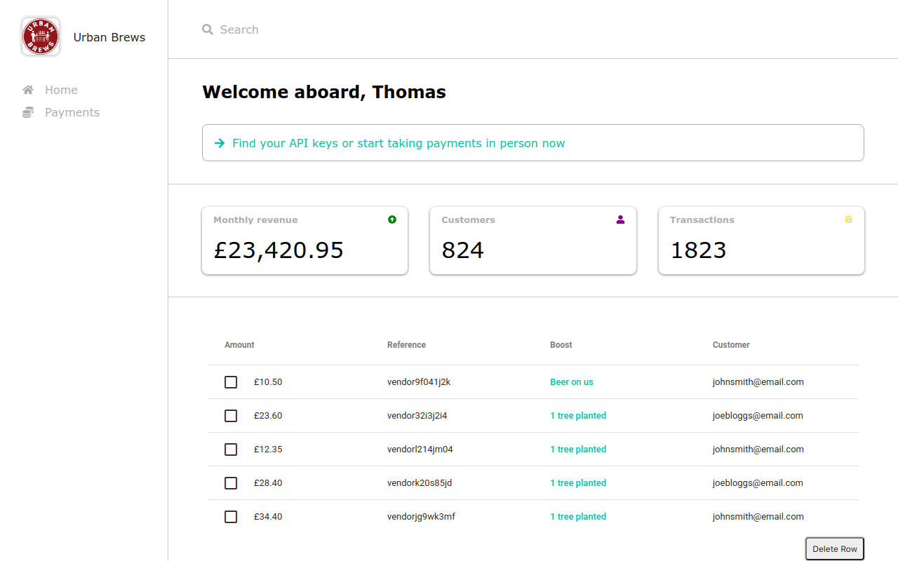

<h1 align="center">Admin Dashboard</h1>

This UI was created using React, Typescript and SASS, built using Webpack and deployed using vercel. It incorporates an AGGrid data grid, with Routing and modern ES6 syntax. Click <a href="https://vendor-dashboard-five.vercel.app/home">here</a> to view.

    <code>
        
    </code>
    <code>
        
    </code>
    <code>
        
    </code>
    <code>
        
    </code>
    <code>
        
    </code>
    <code>
        
    </code>
    <code>
        
    </code>

 

